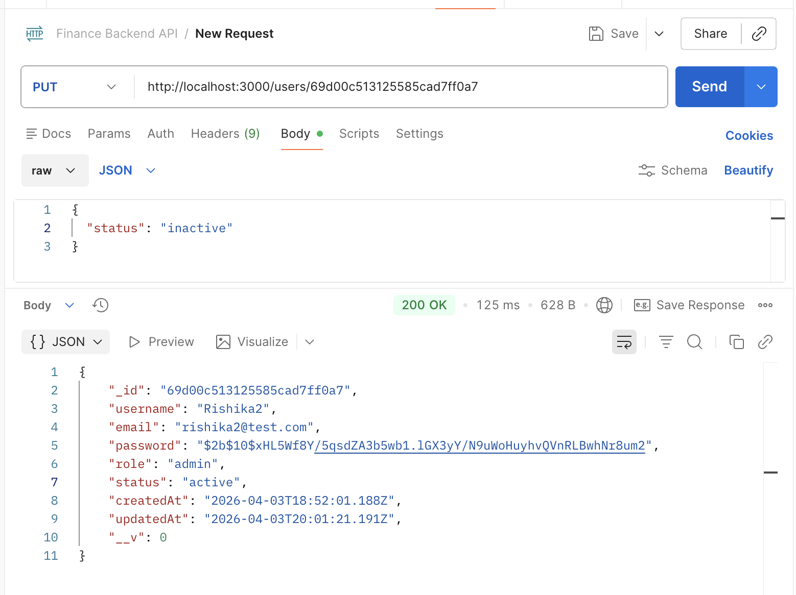
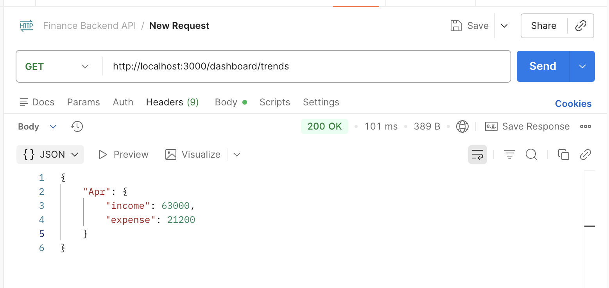

# Multi-Tenant Finance Data Processing & Access Control Backend

## Overview

This project is a **multi-tenant backend system** designed for a finance dashboard. It enables multiple organizations to securely manage their financial records with strict data isolation and role-based access control (RBAC).

Each user belongs to a specific organization, and all data access is restricted within that organization, ensuring complete tenant isolation.

The system demonstrates real-world backend engineering practices including authentication, authorization, audit logging, and scalable API design.

---

## Features

### Multi-Tenant Architecture

* Support for multiple organizations (tenants)
* Each user is associated with a specific organization
* Strict data isolation between organizations
* Shared database with scoped queries for tenant safety

---

### Authentication & Authorization

* JWT-based authentication
* Secure login and registration
* Role-based access control (Admin, Analyst, Viewer)
* Prevent login for inactive users

---

### Role-Based Access Control (RBAC)

| Role    | Permissions                   |
| ------- | ----------------------------- |
| Admin   | Full access (CRUD operations) |
| Analyst | Create + view records         |
| Viewer  | View-only access              |

---

### Financial Records Management

* Create, update, delete financial records
* Fields include amount, type, category, date, and notes
* Records are scoped to organizations
* Filtering support (type, category, date range)

---

### Search & Pagination

* Search records using regex (category, notes)
* Pagination for efficient large dataset handling

---

### Dashboard APIs

* Total income, expenses, net balance
* Category-wise breakdown
* Monthly trends
* Recent activity

---

### Audit Logging

* Tracks all record-related actions:

  * CREATE
  * UPDATE
  * DELETE
* Logs include:

  * user
  * record
  * organization
  * timestamp

---

## Tech Stack

* Node.js
* Express.js
* MongoDB (Mongoose)
* JWT Authentication
* bcryptjs

---

## Setup Instructions

### 1. Clone the repository

```bash
git clone https://github.com/rishika-2626/finance-backend.git
cd finance-backend
```

### 2. Install dependencies

```bash
npm install
```

### 3. Create `.env` file

```env
PORT=3000
MONGO_URI=your_mongodb_connection_string
JWT_SECRET=your_secret_key
```

### 4. Run the server

```bash
npm run dev
```

Server runs at:

```
http://localhost:3000
```

---

## API Endpoints

### Auth

* POST `/auth/register`
* POST `/auth/login`

### Users (Admin Only)

* GET `/users`
* PUT `/users/:id`
* DELETE `/users/:id`

### Records

* POST `/records`
* GET `/records`
* PUT `/records/:id`
* DELETE `/records/:id`

Query params:

* `type`
* `category`
* `search`
* `page`
* `limit`

---

## Design Decisions

* Multi-tenant architecture implemented using organization-based scoping
* Data isolation enforced at query level using `organization` field
* JWT used for stateless authentication with organization context
* Role-based middleware ensures secure access control
* MongoDB chosen for flexible schema design
* Audit logging implemented for traceability of actions

---

## Data Modeling

### Collections:

#### Users

* username
* email
* password
* role
* status
* organization

#### Organizations

* name

#### Records

* amount
* type
* category
* date
* notes
* createdBy
* organization

#### AuditLogs

* action
* user
* record
* organization
* timestamps

---

## Security & Validation

* Input validation for required fields
* Duplicate user prevention
* JWT authentication for protected routes
* Role-based access enforcement
* Organization-based data isolation
* Proper HTTP status codes:

  * `400` – Bad Request
  * `401` – Unauthorized
  * `403` – Forbidden
  * `404` – Not Found
  * `500` – Internal Server Error

---

## Postman Collection

The API can be tested using the provided Postman collection.

### Location

```
postman/finance-backend.postman_collection.json
```

### Authentication

```
Authorization: Bearer YOUR_TOKEN
```

Or use:

```
Authorization: Bearer {{token}}
```

---

## Testing

All APIs were tested using Postman with:

* JWT authentication
* Role-based access control
* Multi-tenant data isolation verification

---

## Key Highlights

* Multi-tenant system with strict data isolation
* Role-based access control (RBAC)
* Audit logging for all critical actions
* Scalable backend architecture
* Clean and modular API design

---


---

## API Screenshots

### Register


---

### Login


---

### Get All Users


---

### Forbidden Access

.png)

---

### Create / Manage Records


---

### Update User Status (Active → Inactive)



---

### Search


---

### Pagination


---

### Filter


---

### Dashboard Summary 


---

### Dashboard Trends



---

## Notes

This project was built as part of a backend engineering assignment to demonstrate API design, access control, and data processing capabilities.

---

## Author

Rishika Thatipamula
