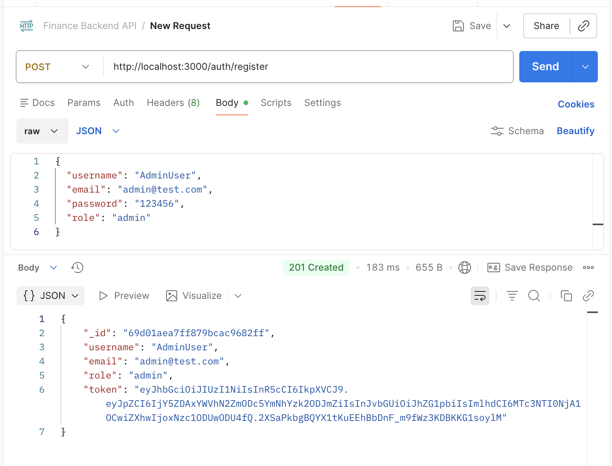
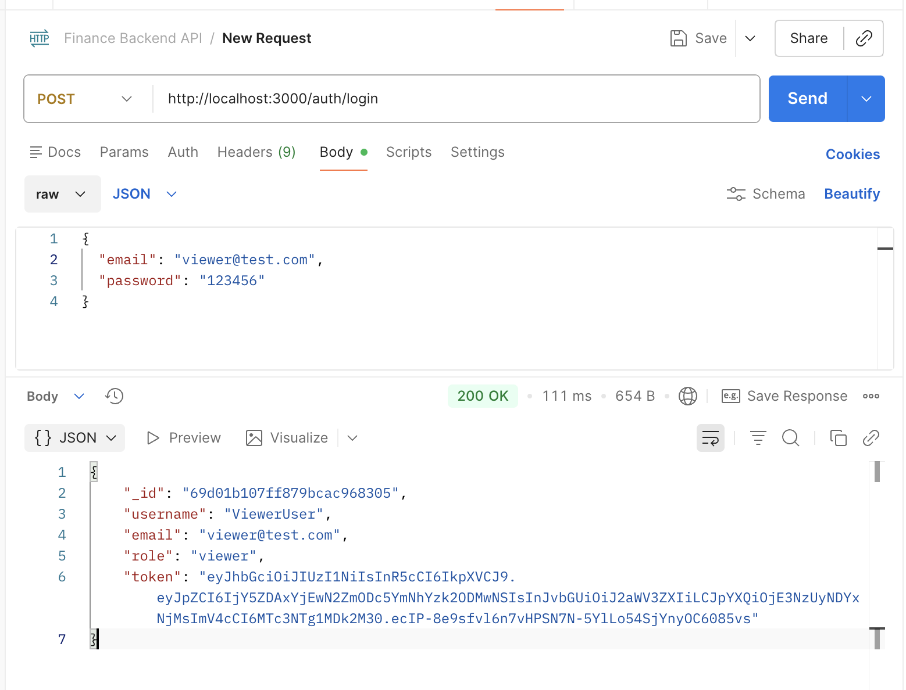
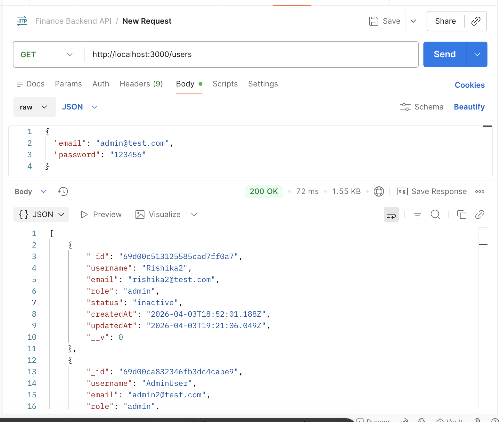
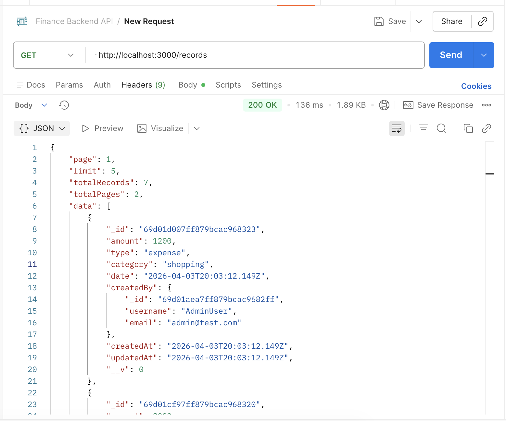
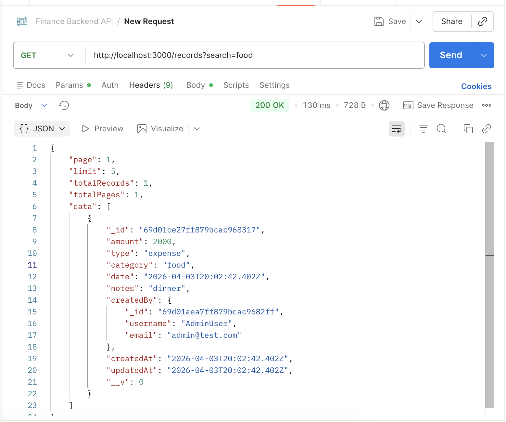
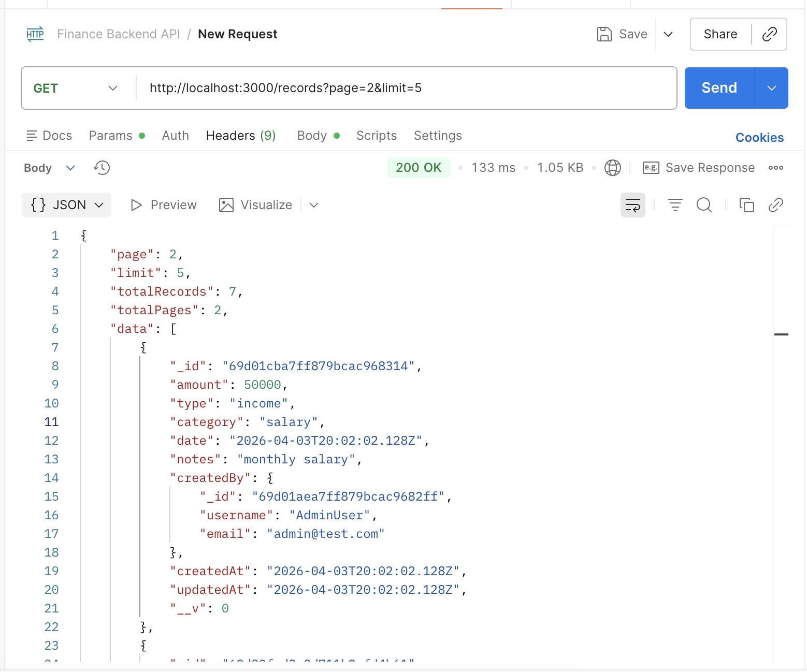
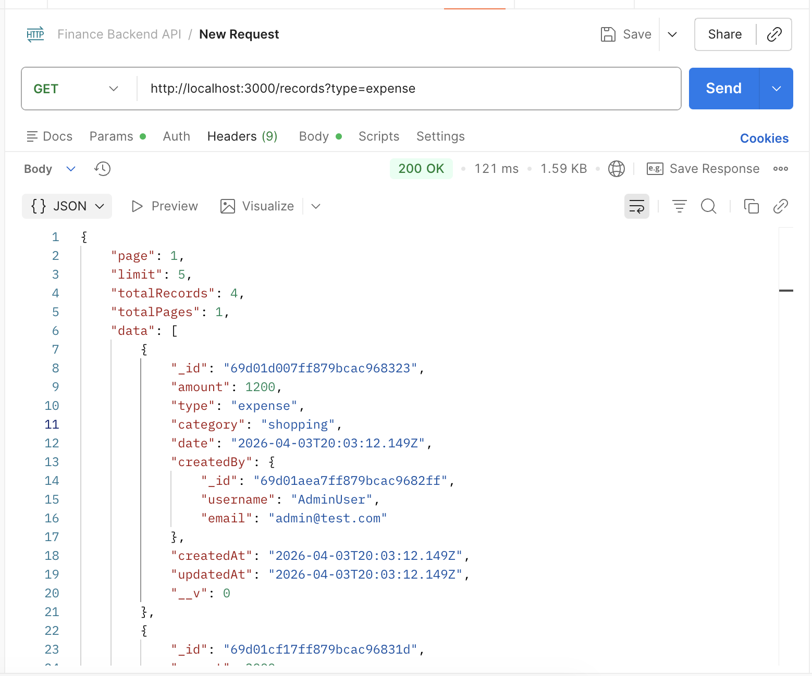
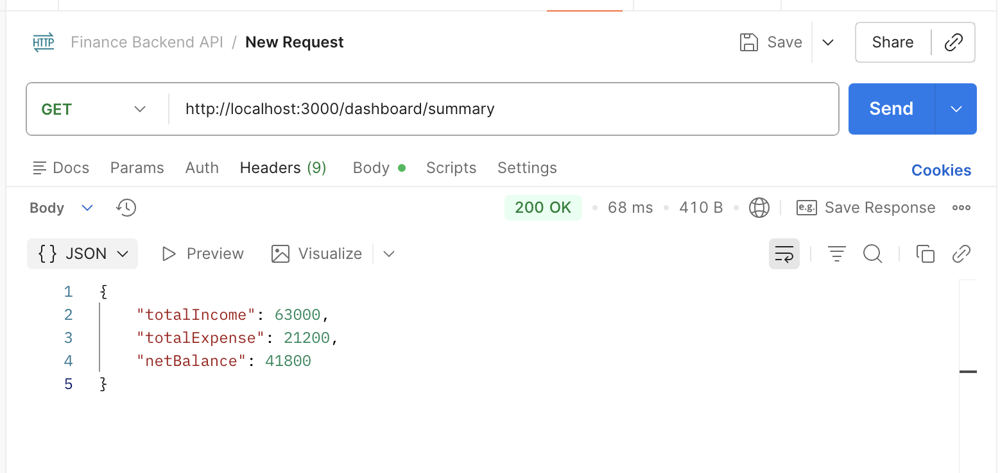

# 💰 Finance Data Processing & Access Control Backend

## 📌 Overview

This project is a backend system for a finance dashboard that manages financial records, user roles, and access control. It provides APIs for handling transactions, enforcing role-based permissions, and generating summary-level analytics for dashboards.

The system is designed with a clean architecture and demonstrates real-world backend development practices.

---

## 🚀 Features

### 🔐 Authentication & Authorization

* JWT-based authentication
* Secure login and registration
* Role-based access control (Admin, Analyst, Viewer)
* Prevent login for inactive users

### 👤 User & Role Management

* Create and manage users
* Assign roles and update status
* Admin-only access for managing users

### 💰 Financial Records Management

* Create, update, delete financial records
* Fields include amount, type, category, date, and notes
* Filtering support (type, category, date range)

### 🔍 Search & Pagination

* Search records by category or notes
* Pagination for efficient data handling

### 📊 Dashboard APIs

* Total income, total expenses, net balance
* Category-wise breakdown
* Monthly trends
* Recent activity

---

## 🛠 Tech Stack

* Node.js
* Express.js
* MongoDB (Mongoose)
* JWT Authentication
* bcryptjs

---

## ⚙️ Setup Instructions

### 1. Clone the repository

```bash
git clone https://github.com/rishika-2626/finance-backend.git
cd finance-backend
```

### 2. Install dependencies

```bash
npm install
```

### 3. Create `.env` file

```env
PORT=3000
MONGO_URI=your_mongodb_connection_string
JWT_SECRET=your_secret_key
```

### 4. Run the server

```bash
npm run dev
```

Server runs at:

```
http://localhost:3000
```

---

## 📡 API Endpoints

### 🔐 Auth

* POST `/auth/register`
* POST `/auth/login`

### 👤 Users (Admin Only)

* GET `/users`
* PUT `/users/:id`
* DELETE `/users/:id`

### 💰 Records

* POST `/records`
* GET `/records`
* PUT `/records/:id`
* DELETE `/records/:id`

Query params:

* `type`
* `category`
* `search`
* `page`
* `limit`

### 📊 Dashboard

* GET `/dashboard/summary`
* GET `/dashboard/categories`
* GET `/dashboard/trends`
* GET `/dashboard/recent`

---

## 🔑 Role Permissions

| Role    | Permissions              |
| ------- | ------------------------ |
| Admin   | Full access              |
| Analyst | View records + dashboard |
| Viewer  | Dashboard only           |

---

## 🧠 Design Decisions

* JWT used for stateless authentication
* Role-based middleware ensures secure access
* MongoDB chosen for flexible schema design
* Dashboard aggregation handled on backend

---

## 🗃️ Data Modeling

* Users and records stored in MongoDB
* Records linked to users via `createdBy`
* Enum fields used for roles and transaction types

---

## ⚠️ Validation & Error Handling

* Required field validation
* Duplicate user checks
* Proper HTTP status codes (400, 401, 403, 500)
* Inactive user login restriction

---

## ⭐ Additional Features

* Pagination
* Search functionality
* Role-based access control
* JWT Authentication
* Inactive user restriction

---

## 📸 API Screenshots

### 🔐 Register



---

### 🔑 Login



---

### 👤 Get All Users



---

### 🚫 Forbidden Access

.png)

---

### 💰 Create / Manage Records



---

### 🔍 Search



---

### 📄 Pagination



---

### 🔍 Filter



---

### 📊 Dashboard Summary ⭐



---

## 📎 Notes

This project was built as part of a backend engineering assignment to demonstrate API design, access control, and data processing capabilities.

---

## 👨‍💻 Author

Rishika Thatipamula
